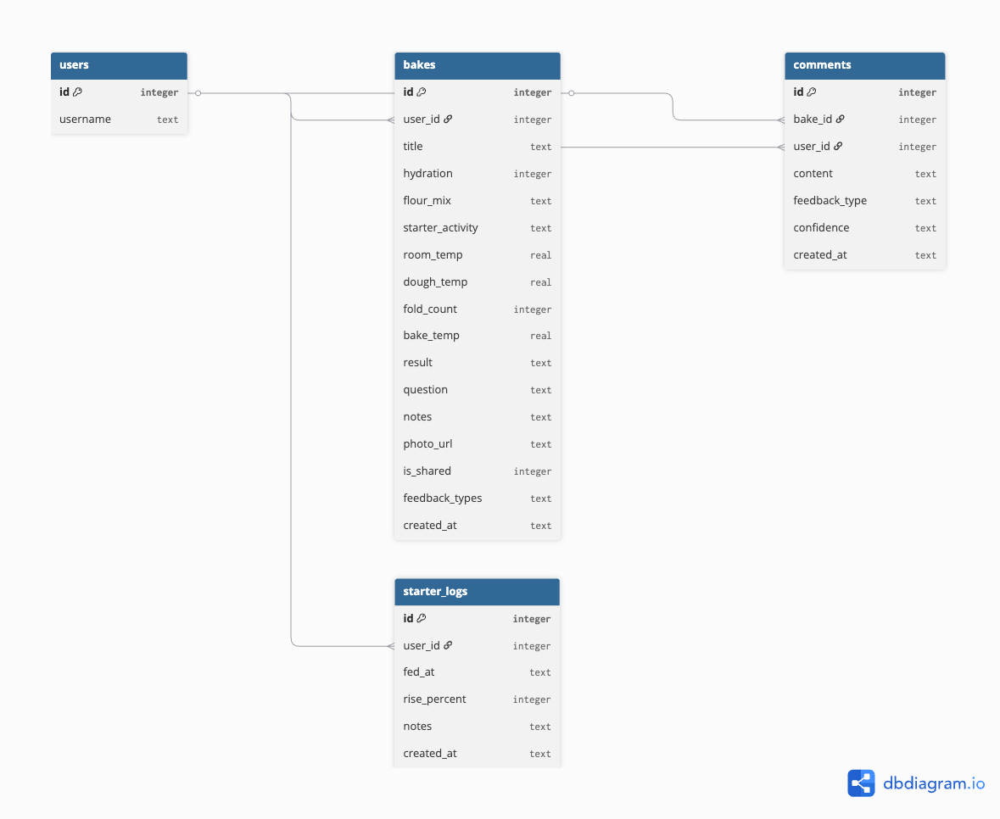

# Introduction

BakeLab began as a response to one core problem: serious sourdough bakers often share their results online, but the feedback they receive is usually too general to help them improve. A photo might get praise, but it does not always explain why the crumb is dense, why the oven spring failed, or which process variable may have caused the issue.

Because of this, I decided that BakeLab should not be designed as a normal social feed. The stronger direction is to treat each bake as a learning case. The goal is not just to post bread photos, but to help users document, compare, and diagnose their baking process.

  
  

    Early discovery report exploring the sourdough baking community and user needs.
  

# Defining the Core Problem

The discovery work helped clarify that the main user need is not entertainment. The main need is structured learning. Sourdough baking depends on many variables, such as hydration, flour mix, starter activity, room temperature, dough temperature, fold count, bake temperature, and timing. If these details are missing, feedback becomes guesswork.

This changed how I interpreted the functional requirements. Instead of asking, “What social features can the app include?”, I asked, “What information does a baker need to understand what happened?”

From that question, the core requirements became clearer:

- users need to create structured bake logs
- users need to record key process variables
- users need to attach a photo or result description
- users need to ask a focused question about their bake
- other users need to give structured feedback

These requirements matter because they support the main purpose of the app: helping bakers learn from repeated practice.

# Why Not a Normal Social Feed?

A normal social feed would be easier to recognise, but it would not fully support the problem BakeLab is trying to solve. Social feeds usually prioritise speed, visual content, and quick reactions. That works well for inspiration, but not for detailed troubleshooting.

For BakeLab, the more useful model is a diagnosis page. This means each bake post should make the process visible, not just the final result. A user should be able to open a bake and quickly understand what was done, what went wrong, and what kind of feedback is being requested.

This decision creates an important trade-off. A diagnosis-style interface is more complex than a simple feed. It requires more fields, clearer layout, and stronger data structure. However, it better matches the actual learning need of the target users.

  
  

    Early desktop-first wireframe exploring structured bake analysis and critique layout.
  

# Core Features vs Optional Features

To keep the project feasible, I separated essential features from optional features.

The core features for the first prototype are:

- a community feed showing shared bakes
- a bake detail page with structured process information
- a new bake form for recording bake data
- a comment or critique system
- basic visibility control for shared bakes

Optional features include:

- real-time chat
- dashboard and advanced analytics
- Adding friend
- notifications
- multi-image galleries

I chose not to prioritise these optional features because they increase technical complexity without being required for the first version of the app. For example, real-time chat may support community interaction, but it does not directly improve bake diagnosis. Advanced analytics could be useful later, but it depends on having enough structured data first.

This scope decision helps keep the prototype realistic for the course timeframe while still addressing the main user problem.

# Data Requirements and Feasibility

The DDD and ERD helped test whether the concept could become a working web application. They showed that BakeLab needs a relational structure because the main objects are connected: users create bakes, bakes receive comments, and comments belong to specific bake posts.

  
  

    Early DDD planning artefact used to evaluate application feasibility and system structure.
  

The early data model suggests that the `bakes` table should store process details such as hydration, flour mix, starter activity, temperatures, result, question, notes, image URL, and sharing status. This supports the diagnosis concept because feedback is connected to actual baking variables, not just a photo.

The ERD also helped identify a key constraint. If the prototype becomes too complex, the database may become harder to build, test, and explain. Because of this, I decided to keep the first version focused on a small number of clear relationships rather than building every possible feature.

    
    

        Initial ERD showing relationships between users, bakes, and critique data. 
    

# Design Direction

The first interface direction is desktop-first because the bake detail page contains a lot of structured information. A desktop layout gives more space for comparing process data, reading notes, and writing feedback. This does not mean mobile is unimportant, but for the first prototype, desktop better supports the main task of careful analysis.

The wireframe also supports this direction by separating the page into clear sections: bake summary, process data, user question, image/result, and critique area. This structure is intended to reduce confusion and help users move from observation to feedback.

# Conclusion

The main decision in this first stage is that BakeLab should be designed as a structured diagnosis platform, not a general social feed. This choice shapes the functional requirements, interface structure, and database design.

The biggest trade-off is that structured data makes the app more complex to design and build. However, it also makes the app more useful for the target users. For the next stage, I need to refine how the bake detail page and critique flow should work so that the interface stays clear, useful, and technically feasible.